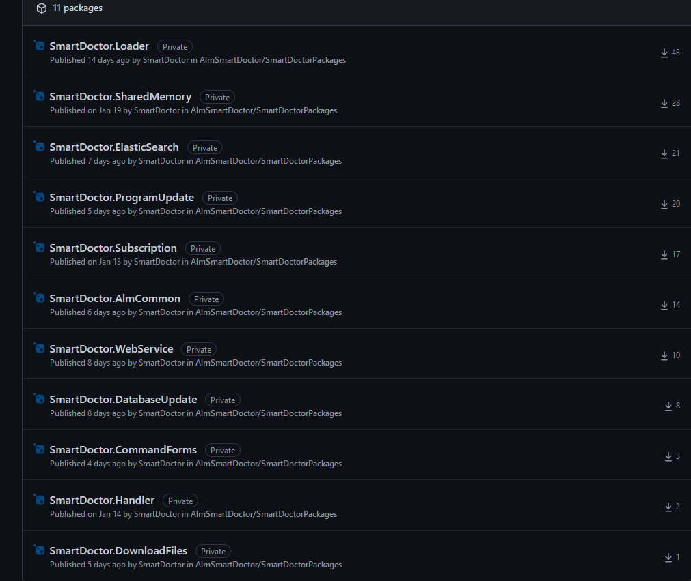

# Git Submodule → Nuget Package

메모: GIt Submodule에서 Nuget Package 이전 후기
속성: 미완성
태그: Architecture, C#, Development, Github

## Git Submodule vs Nuget Package

### Git Submodule 설명

[Git 의 서브모듈(Submodule)](https://sgc109.github.io/2020/07/16/git-submodule/)

### Github Package 설명

[https://musma.github.io/2019/09/30/github-package-registry.html](https://musma.github.io/2019/09/30/github-package-registry.html)

이전 사유

1. git submodule의 경우 두 repository에 대해서 최신 버전 관리가 귀찮음. (클릭 몇 번 더하고 안하고 이긴 한데 진짜 귀찮음)
    - submodule 변경 → Pull Request → Merge
    - submodule 사용하고 있는 repository에 모두 Pull Request 새로 작성 → Merge
    
2. 다른 release life cycle을 가진 repository들에 적용하기에 git submodule이 좋지 않음
    - life cycle이 다른데 항상 최신 버전으로 유지해야 함, 여기는 1.0 저기는 1.1 이런 상황은 있을 수 없음

TODO git submodule flow 추가

## Github Package 사용하기

### Personal access token 생성

```
Github / Settings / Developer settings / Personal access tokens / Generate new token

```

Scope : write:packages, read:packages


다음은 token을 만들어야 한다. 

저 창 끄면 토큰 복사할 기회 없으니까 복사

### Nuget.Config 설정

```
//파일 경로
%AppData%\\Nuget\\Nuget.Config
```

```xml
<?xml version="1.0" encoding="utf-8"?>
<configuration>
    <packageSources>
        <add key="github" value="<http://nuget.pkg.github.com/OWNER/index.json>" />
    </packageSources>
    <packageSourceCredentials>
        <github>
            <add key="Username" value="MY USERNAME" />
            <add key="ClearTextPassword" value="MY TOKEN" />
        </github>
    </packageSourceCredentials>
</configuration>
```

- OWNER : 본인 Organization
- Username : 본인 github username
- ClearTextPassword : 본인 Personal access token

저장

저기 packageSources에 이것 저것 있을 수도 있는데 이게 visual studio에서 보고 있을 package 서버이다. 

보통 nuget.org와 본인이 추가한 패키지들 ex)devexpress 등 이있다.

### Github Nuget Package로 옮긴 패키지들




### Package로 변경하기 좋은 부분

박진영 연구원이 주로 사용하는 SmartMQ, SmartChartServer 에서 package로 바꿀만한 부분

Common_SmartDoctor repository에 적당한 파일이 있어서 이 클래스를 패키지로 변경하기로 했다.

 SystemCommon/DataHandle/NetworkUtil.cs

목표 : 기술 이전을 위해 github package 생성 튜토리얼 진행

SmartMQ 와 SmartChartServer에 Common_SmartDoctor라는 git Submodule을 사용하고 있다.

적당한 클래스 NetworkUtil.cs를 패키지로 변경하기

원래 클래스 하나에 프로젝트 하나로 하는건 이상하긴 한데 튜토리얼이니까 그냥 한다

## Git Submodule → Nuget Package로 변경하기

### Class Library Project 생성

.NET Core 새 클래스 라이브러리 생성

이유는 없고 .NET framework로 생성해도 괜찮다.

dotnet core 라이브러리로 생성하면 csproj 파일이 수정하기 편하다.

### 프로젝트 이름

별다른 설정을 안하면 라이브러리 이름이 패키지 이름이 된다.

내가 프로젝트 이름을 MyProject1 이렇게 하면

패키지도 MyProject1 이렇게 생긴다.


밑줄 친 Newtonsoft.Json, Microsoft.Extensions.DependencyInjection 이런게 다 프로젝트 이름이고 패키지 이름이다.

궁금하면 Newtonsoft.Json 들어가서 보면 좋다.

[Newtonsoft.Json/Src/Newtonsoft.Json at master · JamesNK/Newtonsoft.Json](https://github.com/JamesNK/Newtonsoft.Json/tree/master/Src/Newtonsoft.Json)

네이밍 주의할 점

NetworkUtil니까 Util로 하려고 한다. 사실 이름은 원하는 걸로 합의해서 하면 좋다.

프로젝트 이름을 SmartDoctor.Util 이렇게 해야한다.

이게 이름 기준으로 패키지를 검색해서 그렇다.

내가 처음에 SharedMemory 라는 이름의 패키지를 만들었는데 자꾸 다른 사람 패키지를 다운로드해서 화가 많이 났다^^

이게 왜그러냐면 패키지 검색을 할 때 여러 경로에서 검색을 하는데

경로 + 이름으로 검색을 한다.

예를 들어서 나는 내 github + Util 이러니까 상관 없겠지 했는데 이게 자꾸 nuget.org + Util 이걸 먼저 찾는다.

이유는 사실 몰라요


나랑 비슷한 친구들이 많다.


생성하면 Class1.cs가 달린 라이브러리 하나가 생긴다.

```csharp
using System;

namespace SmartDoctor.Util
{
    public class Class1
    {
    }
}
```

 Class1.cs

```xml
<Project Sdk="Microsoft.NET.Sdk">

  <PropertyGroup>
    <TargetFramework>netcoreapp3.1</TargetFramework>
  </PropertyGroup>

</Project>
```

SmartDoctor.Util.csproj

### Project dotnet TargetFrameworks 호환성 추가

예전에 SmartDoctorCrm의 submodule을 패키지로 변경하면서 SmartNC와의 .net framework 호환성을 고려해야 할 일이 있었는데

바로 multiple dotnet framework version으로 빌드하는 방법이다.

csproj 파일을 조금 고치면 가능하다.

```xml
<Project Sdk="Microsoft.NET.Sdk">

  <PropertyGroup>
    <TargetFrameworks>net35;net46</TargetFrameworks>
    <Version>1.0.0</Version>
    <RepositoryUrl>https://github.com/AlmSmartDoctor/SmartDoctorPackages</RepositoryUrl>
  </PropertyGroup>

</Project>
```

TargetFrameworks : 내가 무슨 버전으로 빌드할 건지

### Project csproj 파일 설정

Version : 패키지 버전 

보통 어셈블리 버전이나 파일 버전을 따라가게 기본 설정인데 난 싫어서 바꿨다.

RepositoryUrl : 내가 어디다가 올릴건지

Author, Owner 등 추가할 수 있는 태그는 많다.

[https://github.com/AlmSmartDoctor/SmartDoctorPackages](https://github.com/AlmSmartDoctor/SmartDoctorPackages) 이게 repository 링크인데 이걸 그대로 넣으면 된다.

ex) 깃허브/본인 organization/올릴 repository 이름

여기 써있는 링크랑 나중에 진짜 올려서 배포할 곳이랑 링크 주소가 맞아야 한다. 따라서 이렇게 넣으면 된다.

### 기존 submodule의 코드 복사 및 수정

NetworkUtil를 복사해서 SmartDoctor.Util 으로 복사한다.

싱글턴 부분 정리하고 camelcase로 변경했다. 


이런 식으로 패키지니까 메서드 참조가 없어서 회색처리 뜨는게 불편하고 나중에 본인이 착각하고 막 지울 것 같다 싶으면


resharper에 이런 기능도 있다.


이제 이 프로젝트에 아까 쓰려고 헀던 NetworkUtil를 넣으면 된다.

### Project Pack

그냥 Release로 바꾸고 프로젝트 우클릭 - 팩 해도 좋고


csproj 있는 폴더 찾아가서 powershell 켜고 다음 커맨드 입력해도 좋다

```powershell
dotnet pack --configuration Release
```

패키지 생성 커멘드

그러면 release폴더에 nupkg 파일이 생긴다.


TODO 아까 만든 프로젝트 이름 + 버전 + .nupkg 자동으로 만들어 진다는 설명 추가

### nupkg 파일 push

여기서 다시 우클릭하고 powershell

```powershell
dotnet nuget push .\SmartDoctor.Util.1.0.0.nupkg --source "github"
```

배포 커멘드

저 —source “github” 이게 아까 nuget.config 파일에 넣은 name-key 부분이다.

[Working with the NuGet registry - GitHub Docs](https://docs.github.com/en/packages/working-with-a-github-packages-registry/working-with-the-nuget-registry)

[GitHub Package 사용하기: NuGet](https://musma.github.io/2020/12/17/github-package-registry-nuget.html)


## submodule과 package 의 중복 참조 제거

### submodule 파일 삭제

이제 해야할 건 기존 submodule에서 쓴 파일을 빼고 내가 만든 패키지를 참조시키는거다.

비포


에프터


networkutil이 없는 submodule은 따로 branch를 만들어서 develop 관리를 해준다.


submodule을 해제하고 나면 이렇게 참조가 없어서 오류가 뜬다.

### nuget package 참조 추가

이제 visual studio에서 도구 - Nuget 패키지 관리자 


여기 보면 github가 있을 것이다. 아까 nuget.config에서 key=”github” 이부분이 이부분이다.

이름 커스텀 하고 싶으면 해도 된다.


아무튼 패키지 소스를 github로 바꿔주면 내가 올린 SmartDoctor.Util이 뜬다.


굿

이제 패키지가 필요한 곳 (기존에 submodule의 networkutil 사용하던 곳)에 다 참조를 넣으면 된다.

이게 찾기 귀찮을 수도 있는데 미리 알고 있으면 좋고 

아니면 빌드해서 오류나는 곳에 넣고


### conflict 처리

참조도 다 넣었으면 이제 코드를 약간 다듬어야 한다.

TODO

이전에 submudle의 networkutil을 사용하기 위한 using 제거 

소문자로 한거 다 대문자로 등등


동네방네 찾아다니면서 다 참조 걸자.

참조 거는 꿀팁

add reference missing file 기능 활용 (왼쪽 전구)

프로젝트 하면 프로젝트만 하고 솔루션 하면 다해준다.


개꿀팁

참조 다 넣어주면 끝

 (난 머리가 더 좋아서 몸이 더 편하다 → 꿀팁 공유좀)

networkutil이 제거된 submodule을 각각 평소 하던 것처럼 관리해주고

SmartMQ에서도 반복

### visual studio의 package 관리

패키지는 visual studio가 packages.config로 관리한다

```powershell
<package id="SmartDoctor.Util" version="1.0.0" targetFramework="net35" />
```

이걸보고 음 받아야할게 좀 있네.. 하고 다운받고 빌드하고 하는 것이다

## 다른 내용들

### 꼭 Github를 사용해야 할까?

사실 꼭 github package로 할 필요는 없다. 내 선택의 이유는 그냥 다른 사람들이 쓰던 플랫폼이니까 새로운 걸 해도 적응하기 쉽지 않을까...

[Overview of Hosting Your Own NuGet Feeds](https://docs.microsoft.com/en-us/nuget/hosting-packages/overview)

여기 보면 nuget을 호스팅하는 여러가지 방법들이 있다.

사실 우리 회사가 폐쇄망에서 개발하는게 아니어서 github package를 쓸 수 있는거지 아니면 그냥 로컬로 서버 설정부터 할게 많아진다.


# 추가해야 하는 내용

패키지 github action 자동 배포

[A NuGet package workflow using GitHub Actions](https://acraven.medium.com/a-nuget-package-workflow-using-github-actions-7da8c6557863)


패키지 내용 디버깅 하는 방법
- F12등 내부 라이브러리 보기
- 기존 프로젝트 참조로 넣기
- 할 때 마다 pack해서 로컬로 넣어주기


### 디버깅 꿀팁

networkUtil을 사용해 간단한 콘솔 프로그램을 만들었다.

```csharp
internal class Program
{
    static void Main(string[] args)
    {
        Console.WriteLine(NetworkUtil.GetInstance().GetLocalIPv4());
        Console.ReadLine();
    }
}
```
